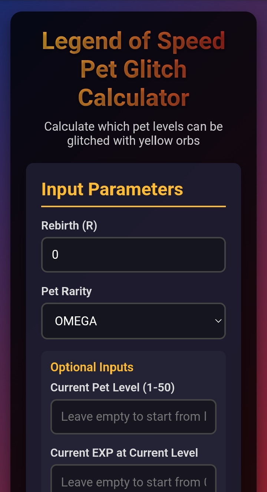
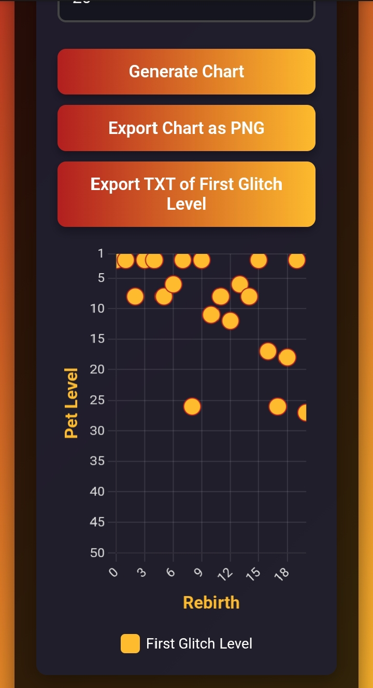
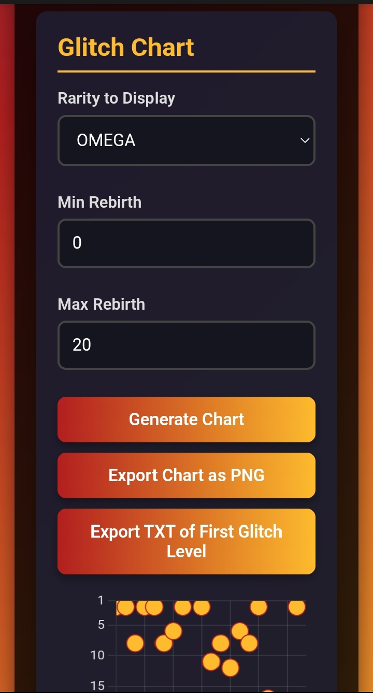
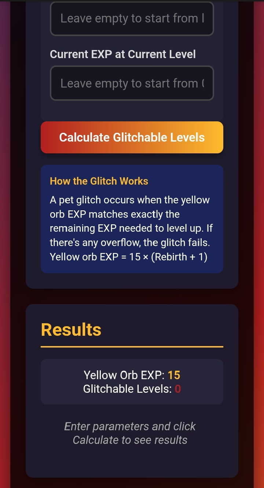

# Legend-of-speed-pet-glitch-calculator
A web-based calculator and visualizer for Legend of Speed pets. Quickly find glitchable levels using yellow orbs, generate charts for first-glitch levels, and export results in TXT or PNG format.

## 🚀 Features

- **Glitchable Level Calculator**: Enter your pet rarity, rebirth, current level, and EXP to see which levels are glitchable.
- **Chart Visualization**: Scatter chart showing **first-glitch levels** per rebirth.
- **Export Options**: Export results as a **TXT file** or **PNG image**.
- **Mobile-Friendly Design**: Fully responsive and optimized for Android/iOS browsers.
- **Min/Max Rebirth Filter**: Customize the chart to show only specific rebirth ranges.
- **Optional Inputs**: Include current level and EXP to calculate more accurate results.
- **Tooltips & Legends**: Hover over points to see detailed info.

---

## 🌟 Screenshot 

---

## 📋 How to Use

1. Open the **index.html** in any browser.
2. In the **Input Parameters** section, select:
   - **Rebirth** (0+)
   - **Pet Rarity** (BASIC → OMEGA)
   - Optional: Current Level & EXP
3. Click **Calculate Glitchable Levels** to see the results.
4. Switch to the **Glitch Chart** section to visualize the first glitch per rebirth.
5. Use **Min/Max Rebirth** inputs to filter chart data.
6. Export your results:
   - **TXT**: First glitch level per rebirth.
   - **PNG**: Current chart view.

---

## 📊 Chart

- Scatter chart displaying **first glitchable level per rebirth**.
- X-axis: Rebirths  
- Y-axis: Pet Level (1–50)  
- Hover over points to see exact Level & Rebirth.

---

## 💻 Tech Stack

- **HTML5 / CSS3**: Mobile-responsive layout and design  
- **JavaScript**: Core calculation and chart logic  
- **Chart.js**: Scatter chart visualization

---

## 📝 License

This project is **for educational purposes**. Feel free to fork, modify, and experiment with it.

---
## 🔗 Website

https://jujux1.github.io/Legend-of-speed-pet-glitch-calculator/

